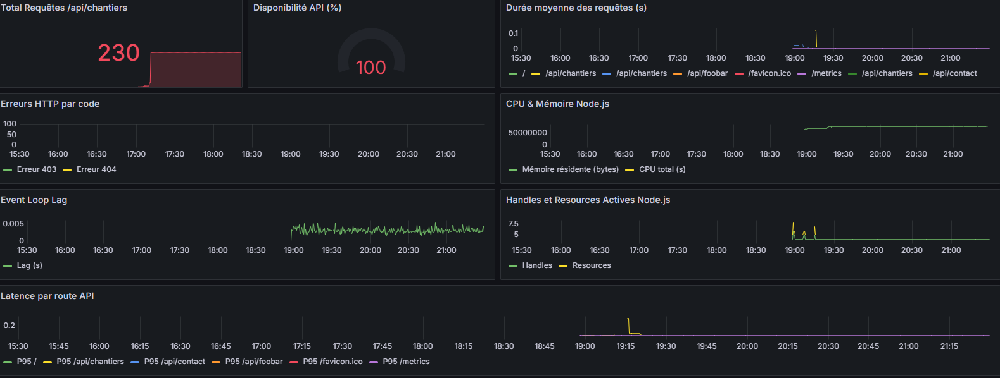
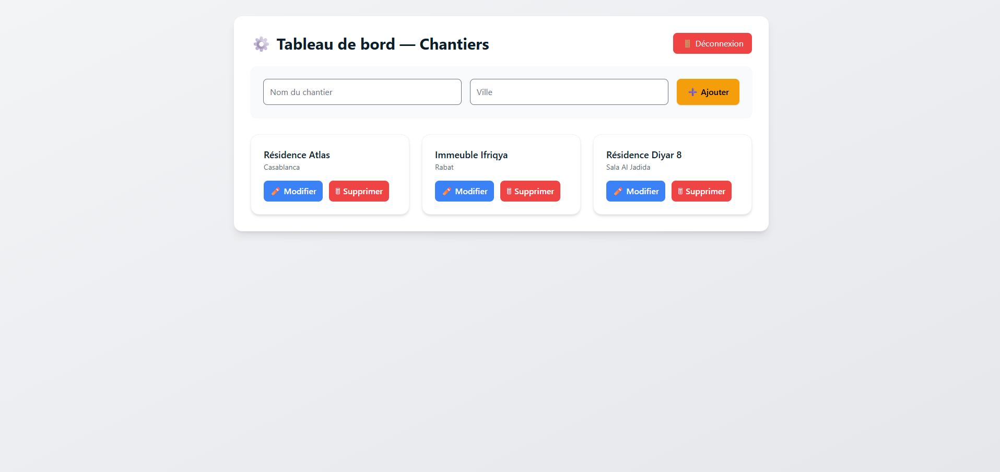
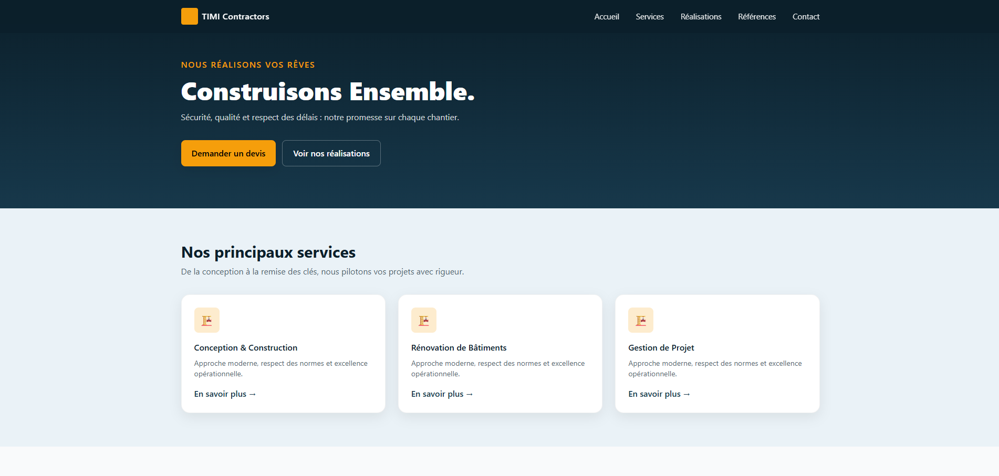
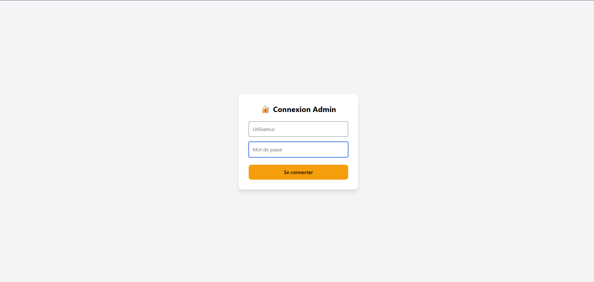
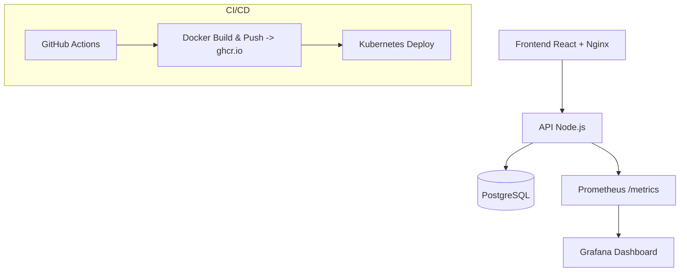

# 🏗️ TIMI Contractors — DevOps Chantiers Platform  


> Plateforme complète de **gestion de chantiers** moderne, intégrant **DevOps, monitoring et CI/CD**,  
> déployée via **Docker Compose** et **Kubernetes**, et supervisée avec **Prometheus + Grafana**.

---

## 📸 Aperçus

| Dashboard Grafana | Interface Admin | Page d’accueil |
|--------------------|------------------|----------------|
|  |  |  |  |


---

## 🧩 Architecture Globale



---

## ⚙️ Stack Technique

| Couche | Technologie | Description |
|--------|--------------|-------------|
| **Frontend** | React + Tailwind + Nginx | Interface utilisateur moderne |
| **Backend** | Node.js (Express) + PostgreSQL | API RESTful sécurisée (JWT) |
| **Monitoring** | Prometheus + Grafana | Collecte et visualisation des métriques |
| **DevOps** | Docker Compose + GitHub Actions + Kubernetes | Déploiement et CI/CD |
| **Email Service** | Nodemailer (SMTP) | Formulaire de contact professionnel |
| **Tests** | Jest + Supertest | Tests API automatisés |

---

## 🧱 Structure du projet

```
timi-devops-chantiers/
├── app/
│   ├── api/                # Backend Node.js + Prometheus
│   │   ├── src/
│   │   │   ├── index.js
│   │   │   ├── server.js
│   │   │   ├── metrics.js
│   │   │   └── contact.js
│   │   ├── tests/
│   │   └── Dockerfile
│   └── frontend/           # Frontend React (Vite + Tailwind)
│       ├── src/
│       ├── public/
│       └── Dockerfile
├── db/
│   └── init/001_init.sql   # Script SQL d’initialisation
├── k8s/                    # Manifests Kubernetes
├── docker-compose.yml      # Stack Docker Compose
├── .github/workflows/      # Pipeline CI/CD GitHub Actions
└── README.md
```

---

## 🧠 Fonctionnalités principales

✅ Authentification JWT (Admin)  
✅ CRUD complet des chantiers  
✅ Tableau de bord React responsive  
✅ Envoi d’e-mails via SMTP (Outlook, Mailtrap, Gmail)  
✅ Monitoring complet (Prometheus + Grafana)  
✅ Tests unitaires avec Jest  
✅ Pipeline CI/CD GitHub Actions  
✅ Déploiement local (Docker Compose) ou production (Kubernetes)

---

## 🧰 Déploiement local (Docker Compose)

### 1️⃣ Configuration du fichier `.env`

```bash
# ==== Base de données ====
POSTGRES_DB=timi
POSTGRES_USER=timi
POSTGRES_PASSWORD=timi
POSTGRES_PORT=5432

# ==== API ====
API_PORT=5000
NODE_ENV=development
DATABASE_URL=postgres://timi:timi@db:5432/timi
JWT_SECRET=supersecret

# ==== Frontend ====
VITE_API_URL=http://localhost:5000

# ==== SMTP ====
SMTP_HOST=smtp.office365.com
SMTP_PORT=587
SMTP_USER=walid_fath@um5.ac.ma
SMTP_PASS=motdepasse
CONTACT_RECEIVER=walidfath02@gmail.com
```

### 2️⃣ Lancer la stack

```bash
docker-compose up --build -d
```

### 3️⃣ Vérification

```bash
curl http://localhost:5000/health
curl http://localhost:5000/metrics
```

### 4️⃣ Accès

| Service | URL | Description |
|----------|-----|-------------|
| **Frontend** | http://localhost:3000 | Interface utilisateur |
| **API** | http://localhost:5000/api/chantiers | Backend |
| **Metrics** | http://localhost:5000/metrics | Prometheus endpoint |

---

## ☸️ Déploiement Kubernetes (Production)

### Architecture

Namespace : `timi`

**Services :**
- `timi-db` → PostgreSQL 16  
- `timi-api` → API Node.js  
- `timi-frontend` → React + Nginx  
- `ServiceMonitor` pour Prometheus

### Fichiers Kubernetes

```
k8s/
├── namespace.yaml
├── postgres.yaml
├── api.yaml
├── frontend.yaml
├── configmap.yaml
├── secret.yaml
└── prometheus-scrape.yaml
```

### Commandes de déploiement

```bash
kubectl apply -f k8s/namespace.yaml
kubectl apply -f k8s/secret.yaml -n timi
kubectl apply -f k8s/postgres.yaml -n timi
kubectl apply -f k8s/api.yaml -n timi
kubectl apply -f k8s/frontend.yaml -n timi
kubectl apply -f k8s/prometheus-scrape.yaml -n monitoring
```

### Accès production

| Service | URL | Description |
|----------|-----|-------------|
| **Frontend** | http://<IP_VPS>:30524 | Interface publique |
| **API** | http://<IP_VPS>:30523/api | Backend |
| **Metrics** | http://<IP_VPS>:5000/metrics | Prometheus endpoint |

---

## 🔁 CI/CD GitHub Actions

📄 `.github/workflows/cicd.yml`

Le pipeline GitHub Actions exécute automatiquement :

| Étape | Description |
|--------|-------------|
| 🧪 **Tests** | Exécution des tests API avec Jest |
| 🏗️ **Build** | Création des images Docker (API & Frontend) |
| 📦 **Push** | Publication sur GitHub Container Registry |
| 🚀 **Deploy** | Déploiement sur Kubernetes |

### 🔐 Secrets requis

| Nom | Description |
|------|-------------|
| `SMTP_HOST`, `SMTP_PORT`, `SMTP_USER`, `SMTP_PASS`, `CONTACT_TO` | Pour l’envoi d’e-mails |
| `KUBECONFIG_DATA` | Pour l’accès au cluster Kubernetes |
| `GH_TOKEN` *(optionnel)* | Pour publier les images sur GitHub Container Registry |

---

## 📊 Monitoring (Grafana & Prometheus)

### 📡 Métriques exposées

```bash
# HELP http_requests_chantiers_total Nombre total de requêtes GET sur /api/chantiers
# TYPE http_requests_chantiers_total counter
# HELP http_requests_errors_total Nombre d'erreurs HTTP
# TYPE http_requests_errors_total counter
# HELP http_request_duration_seconds Durée moyenne des requêtes API
```

### 🔍 Dashboard Grafana : *“TIMI API — Full Monitoring”*

Ce tableau de bord affiche :

- Total des requêtes API  
- Latence moyenne (P95)  
- Uptime (%)  
- Erreurs HTTP par code  
- Mémoire & CPU Node.js  
- Event Loop Lag  

Exemple :

```bash
curl http://localhost:5000/metrics | grep http_requests_chantiers_total
```

---

## 👤 Auteur

**👨‍💻 FATH WALID**  
🎓 Étudiant En 3eme Année Au Cycle Ingénieur — *ISGA Rabat*  
💼 Spécialité : Ingénierie Du Développement Web Et Mobile 
🔗 [GitHub](https://github.com/FathWalid) • [LinkedIn](https://linkedin.com/in/walid-fath-isga)

---

## 🏁 License

Distribué sous licence **MIT**.
